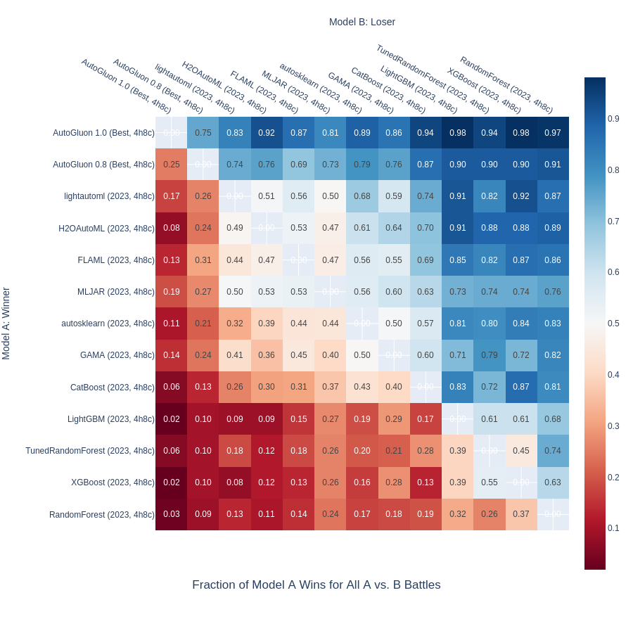
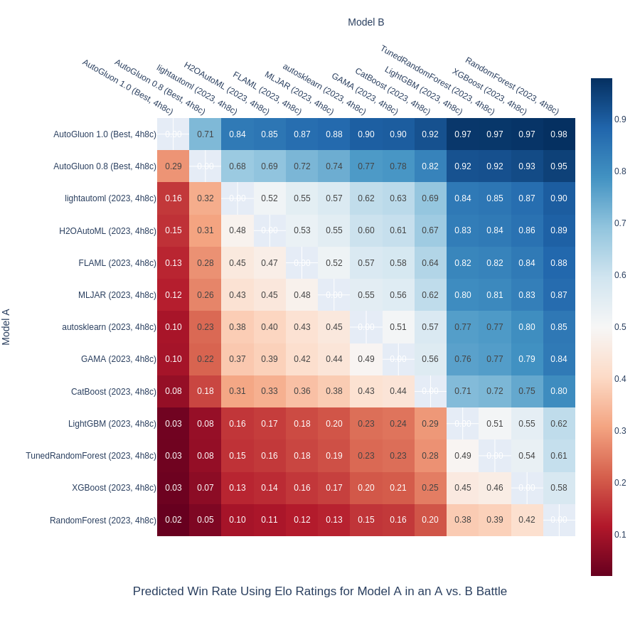
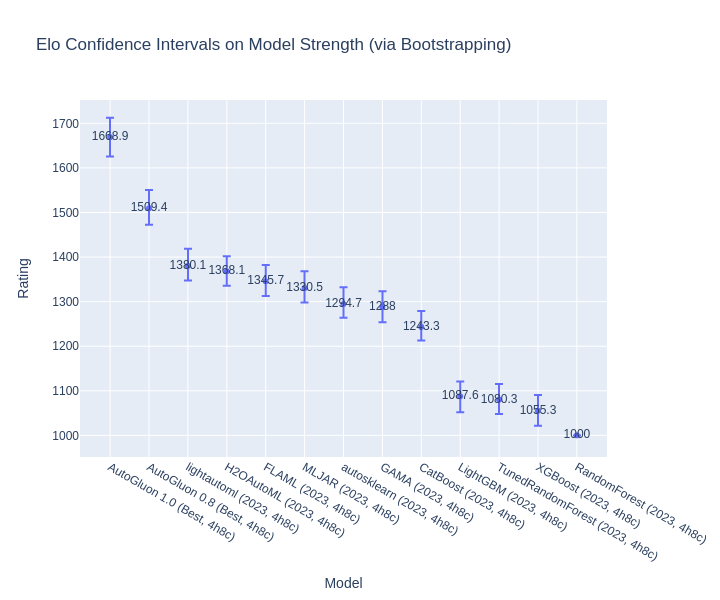
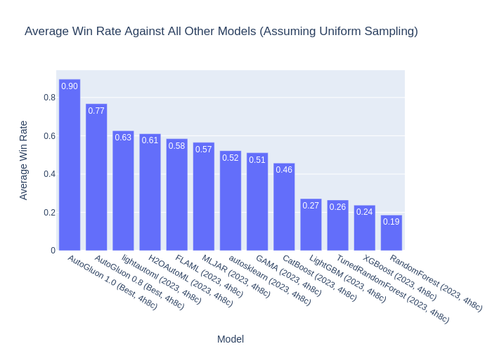
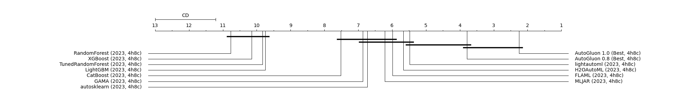
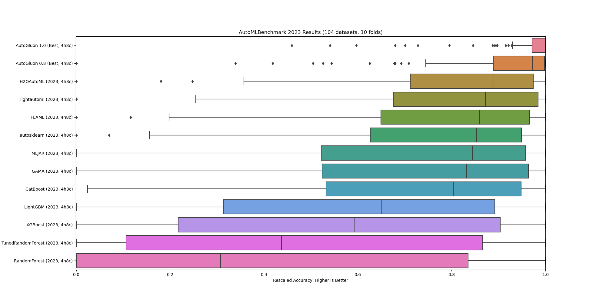
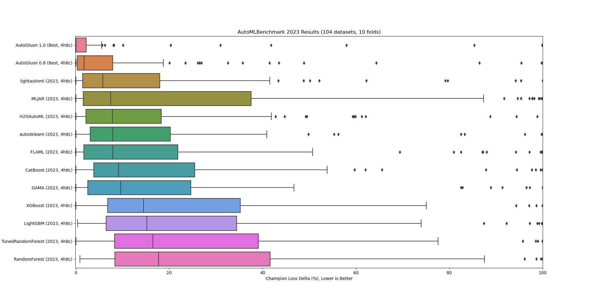

# AutoML Arena

Inspired by ChatBot Arena: https://huggingface.co/spaces/lmsys/chatbot-arena-leaderboard

|   Rank | Model                          |   Arena Elo | 95% CI   |   Battles |   Wins | Winrate |
|-------:|:-------------------------------|------------:|:---------|----------:|-------:|--------:|
|      1 | AutoGluon 1.0 (Best, 4h8c)     |        1669 | +43/-44  |      1248 |   1118 |    0.90 |
|      2 | AutoGluon 0.8 (Best, 4h8c)     |        1509 | +41/-37  |      1248 |    958 |    0.77 |
|      3 | lightautoml (2023, 4h8c)       |        1380 | +39/-33  |      1248 |    782 |    0.63 |
|      4 | H2OAutoML (2023, 4h8c)         |        1368 | +34/-32  |      1248 |    762 |    0.61 |
|      5 | FLAML (2023, 4h8c)             |        1346 | +36/-33  |      1248 |    730 |    0.58 |
|      6 | MLJAR (2023, 4h8c)             |        1331 | +37/-33  |      1248 |    706 |    0.57 |
|      7 | autosklearn (2023, 4h8c)       |        1295 | +37/-31  |      1248 |    652 |    0.52 |
|      8 | GAMA (2023, 4h8c)              |        1288 | +35/-34  |      1248 |    638 |    0.51 |
|      9 | CatBoost (2023, 4h8c)          |        1243 | +35/-30  |      1248 |    570 |    0.46 |
|     10 | LightGBM (2023, 4h8c)          |        1088 | +33/-36  |      1248 |    338 |    0.27 |
|     11 | TunedRandomForest (2023, 4h8c) |        1080 | +35/-32  |      1248 |    330 |    0.26 |
|     12 | XGBoost (2023, 4h8c)           |        1055 | +35/-34  |      1248 |    296 |    0.24 |
|     13 | RandomForest (2023, 4h8c)      |        1000 | +0/-0    |      1248 |    232 |    0.19 |

